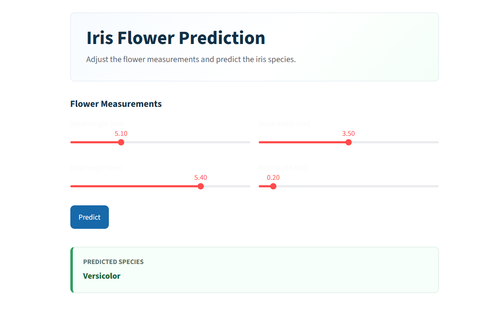
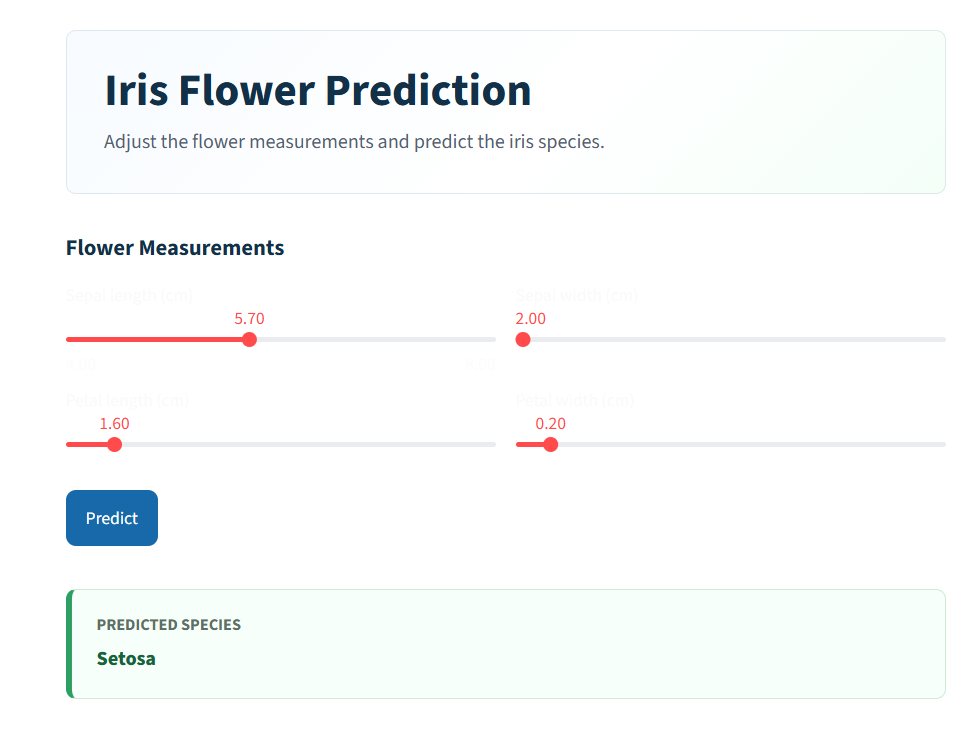

# Iris Flower Prediction App

An interactive machine learning web app that predicts the species of an iris flower using sepal and petal measurements. The project uses a trained classification model with a clean Streamlit interface, making it simple for anyone to test predictions in the browser.



## Why This Project Stands Out

This project takes a classic machine learning problem and turns it into a real usable web application. Instead of keeping the model only inside a notebook, the trained model is connected with a simple UI where users can adjust values and instantly see the predicted iris species.

## Key Features

- Interactive Streamlit web app
- Slider-based inputs for all four iris measurements
- Trained ML model loaded from a Pickle file
- Instant prediction for Setosa, Versicolor, and Virginica
- Clean and modern interface
- Beginner-friendly code structure
- Easy to run locally

## App Preview

### Prediction Example: Versicolor


### Prediction Example: Setosa



## Tech Stack

- Python
- Streamlit
- NumPy
- Scikit-learn
- Pickle
- Jupyter Notebook

## Machine Learning Workflow

The project follows a simple ML workflow:

1. Load the Iris dataset
2. Train a classification model
3. Save the trained model as `iris_dataset.pkl`
4. Load the model inside the Streamlit app
5. Take user input through sliders
6. Predict the iris flower species

## Project Structure

```text
IRIS_PROJECT/
├── app.py
├── iris_dataset.pkl
├── iris_dataset.ipynb
├── iris (1).csv
├── assets/
│   ├── prediction-setosa.png
│   └── prediction-versicolor.png
├── .gitignore
└── README.md
```

## How To Run Locally

Clone the repository:

```bash
git clone https://github.com/ankitpal85/iris-streamlit-app.git
```

Go to the project folder:

```bash
cd iris-streamlit-app
```

Install the required libraries:

```bash
pip install streamlit numpy scikit-learn
```

Run the app:

```bash
streamlit run app.py
```

Then open the local URL shown in the terminal.

## Input Features

The model uses four flower measurements:

- Sepal length
- Sepal width
- Petal length
- Petal width

Based on these values, the app predicts one of the following species:

- Setosa
- Versicolor
- Virginica

## What I Learned

Through this project, I practiced:

- Building a machine learning classification project
- Saving and loading ML models with Pickle
- Creating an interactive frontend with Streamlit
- Connecting a trained model with a real web app
- Improving project presentation for GitHub
- Using Git and GitHub for version control

## Future Improvements

- Add prediction probability for each species
- Add model accuracy, confusion matrix, and evaluation metrics
- Add visual charts for dataset analysis
- Add a `requirements.txt` file
- Deploy the app on Streamlit Community Cloud
- Add live demo link in the README

## Author

**Ankit Pal**

GitHub: [ankitpal85](https://github.com/ankitpal85)

## Project Goal

The goal of this project is to show how a machine learning model can be transformed into a real application. It is simple enough for beginners to understand and polished enough to include in a portfolio.
